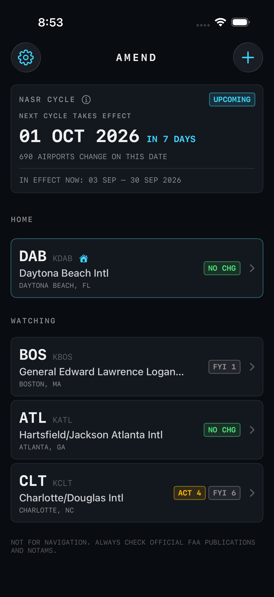
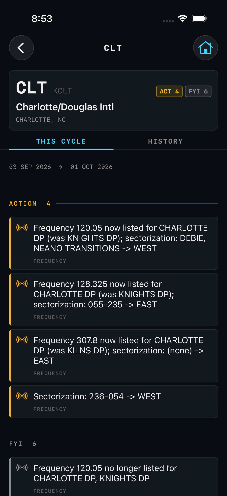
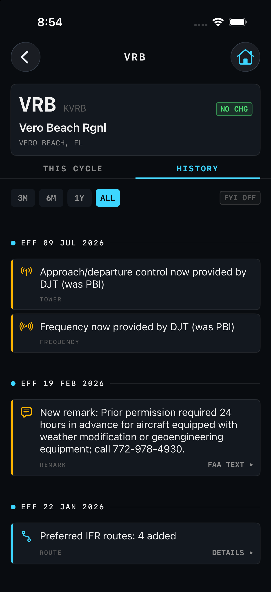
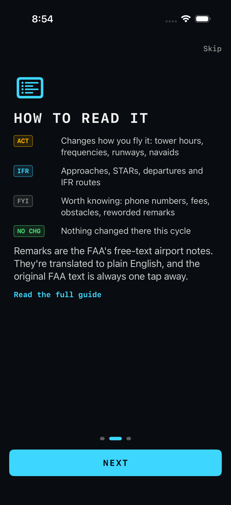

# Amend.

**Know what changed at your airports every FAA cycle.**

Every 28 days the FAA publishes a new cycle of airport, airspace, frequency and chart data. The changes that matter (tower hours, a decommissioned VOR, a renumbered runway, an amended approach) are buried among tens of thousands of rows of bookkeeping noise. Amend diffs every cycle for every US airport, filters out the noise, and explains what's left in plain English, ranked by whether it changes how you fly. It shows upcoming changes up to three weeks before they take effect.

<p align="center">
  
  
  
  
</p>

## Why

It started with a quiz question marked wrong. The course material said Vero Beach's tower closed at 2100, which would make the airspace Class E at a 2300 arrival. The current Chart Supplement says 0100. Amend's history shows exactly what happened:

```
VRB  Vero Beach Rgnl
 EFF 10 JUL 2025   !! tower hours changed: 0700-2300 -> 0700-0100 local
                   !! airspace is now: class d svc 0700-0100; other times class e
 EFF 23 JAN 2025   !! tower hours changed: 0700-2100 -> 0700-2300 local
                   !! airspace is now: class d svc 0700-2300; other times class e
```

The course was two changes behind.

## The app

SwiftUI, iOS 17+, styled like an EFB.

- **Your airports** with a home field pinned on top, each showing annunciator-style counts: `ACT` (changes how you fly it), `IFR` (approaches, STARs, departures, routes), `FYI`, or `NO CHG`
- **Search** by FAA id, ICAO, name or city across ~20,000 airports
- **This cycle** and **History** (back to Aug 2024) for every airport, with the original FAA text behind every translated remark and a direct link to each new approach plate
- **Notifications** once per cycle when your airports are affected: any change at your home field, action items elsewhere
- **Guide and onboarding** that explain the tiers, remarks and cycles

## How it works

A GitHub Action runs daily. It downloads the FAA NASR 28-day subscription and d-TPP chart metadata, diffs every US airport (about 15 seconds), and publishes static JSON to GitHub Pages. The app reads that JSON; there is no server.

- **Airports and airspace:** tower and Class D hours, frequencies, navaids, runways (including renumbering from magnetic drift and declared distances), attendance hours, phone numbers, new and closed airports, remarks
- **Charts:** added, amended and removed approaches, departures, STARs and airport diagrams, with links to the new PDF plates
- **Plain-English remarks:** FAA contractions ("RSCD NOT MNT 2300-0600 M-F") are translated with Claude using a fixed glossary. Unknown abbreviations are left as-is rather than guessed, and the original FAA text is always kept
- **Noise filtering:** survey dates, pavement codes, coordinate rounding, duplicate files and reworded remarks are hidden or demoted, and one real-world event (a renumbered runway, a new airport, a new STAR version) becomes one line instead of dozens of raw rows

Data is public at `https://benjgmin.github.io/amend/`, documented in [SCHEMA.md](SCHEMA.md).

## Repo layout

| path | what |
|---|---|
| `ios/` | the SwiftUI app |
| `amend/rules.py` | what counts as noise and how important each change is. tuning happens here |
| `amend/nasr.py`, `diff.py` | reading FAA zips and diffing two cycles |
| `amend/collapse.py`, `english.py` | turning raw rows into events and plain-English summaries |
| `amend/remarks.py` | translating remarks with Claude |
| `amend/dtpp.py` | approach plate / chart changes |
| `amend/pipeline.py` | the whole diff in one call, public JSON shape |
| `amend/history.py`, `latest.py`, `airports.py` | history timeline, the published site, airport directory |
| `tests/` | regression tests built from real cases found in FAA data |
| `SCHEMA.md` | the JSON format the app relies on |

## Run it locally

Backend: Python 3.11+, standard library only.

```bash
python -m amend set-key            # one time: Anthropic key for --llm, saved to .env

python -m amend diff 03_Sep_2026_CSV.zip 01_Oct_2026_CSV.zip VRB DAB ISM --llm
python -m amend diff 03_Sep_2026_CSV.zip 01_Oct_2026_CSV.zip --all-airports --dtpp d-tpp_Metafile.xml

python -m amend history            # build/extend history/ back to Aug 2024
python -m amend latest             # build site/ (what the GitHub Action runs)

python -m unittest discover -s tests -t .
```

App: open `ios/Amend.xcodeproj` in Xcode and run.

NASR data comes from the [FAA 28-Day NASR Subscription](https://www.faa.gov/air_traffic/flight_info/aeronav/aero_data/NASR_Subscription/), charts from the [FAA d-TPP](https://www.faa.gov/air_traffic/flight_info/aeronav/digital_products/dtpp/).

## Roadmap

- TestFlight
- Home screen widget for your home airport
- Waypoint-level detail for STAR/DP changes
- Match navaids to nearby airports in all-airports mode

## Disclaimer

**Not for navigation.** Amend is a study and awareness tool. Always use official FAA publications, NOTAMs and a proper preflight briefing.

## License

MIT. FAA data is public domain.