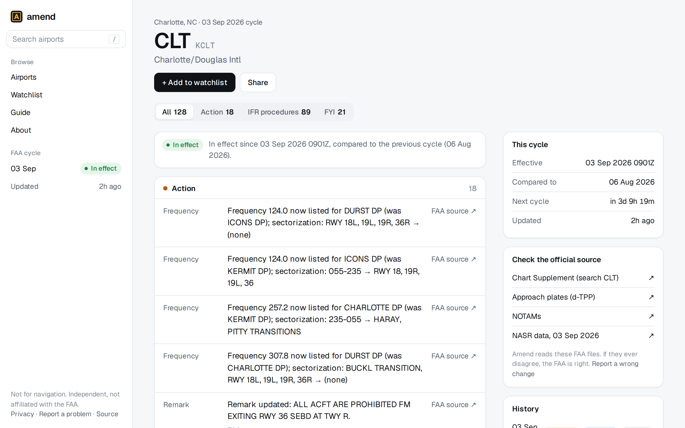

<p align="center">
  <picture>
    <source media="(prefers-color-scheme: dark)" srcset="docs/brand/lockup-dark.svg">
    
  </picture>
</p>

<h3 align="center">What changed at your airport, every FAA cycle.</h3>

<p align="center">
  <a href="https://amend.watch/"><b>amend.watch</b></a> ·
  <a href="https://amend.watch/about/#how">How it works</a> ·
  <a href="https://amend.watch/guide/">Guide</a> ·
  <a href="https://github.com/benjgmin/amend/issues/new">Report a problem</a>
</p>

Every 28 days the FAA publishes a new cycle of airport, airspace, frequency and chart data. The changes that matter (tower hours, a decommissioned VOR, a renumbered runway, an amended approach) are buried among tens of thousands of rows of bookkeeping noise. Amend diffs every cycle for every US airport, filters out the noise, and explains what's left in plain English, ranked by whether it changes how you fly. It shows upcoming changes up to three weeks before they take effect.

<picture>
  <source media="(prefers-color-scheme: dark)" srcset="docs/screenshots/web/airport-dark.png">
  
</picture>

## Why

Vero Beach's tower hours changed twice in six months, and nothing tells you when that happens. Amend's history shows exactly what changed:

```
VRB  Vero Beach Rgnl
 EFF 10 JUL 2025   !! tower hours: 0700-2300 -> 0700-0100 local
                   !! airspace: class d svc 0700-2300 -> class d svc 0700-0100
 EFF 23 JAN 2025   !! tower hours: 0700-2100 -> 0700-2300 local
                   !! airspace: class d svc 0700-2100 -> class d svc 0700-2300
```

## On the web

**[amend.watch](https://amend.watch/)**: search any airport, or go straight to one, like
[amend.watch/VRB](https://amend.watch/VRB/) (lowercase and ICAO ids like amend.watch/kvrb work too). Save airports to a
watchlist in your browser and share it as one link. Every airport with changes gets its own page with a link preview,
so a page shared in iMessage or a group chat shows what changed. [amend.watch/about](https://amend.watch/about/) covers
how it works, what it doesn't cover and what it stores.

## The iPhone app

In testing, not on the App Store yet. SwiftUI, iOS 17+, light and dark.

- **Your airports** with a home field pinned on top, each showing counts: `ACT` (changes how you fly it), `IFR` (approaches, STARs, departures, routes), `FYI`, or `No change`
- **Search** by FAA id, ICAO, name or city across ~20,000 airports
- **Upcoming** and **History** (back to Aug 2024) for every airport, clearly marked as not in effect yet until the 0901Z changeover, with the original FAA text behind every translated remark
- **Approach plates in the app:** amended charts open right inside Amend, with zoom and a share button to save them or open them in another EFB
- **Notifications** once per cycle when your airports are affected: any change at your home field, action items elsewhere
- **Guide and onboarding** that explain the tiers, remarks and cycles

## How it works

A GitHub Action checks the FAA every 3 hours and rebuilds when there's something new (or at least daily). It downloads the FAA NASR 28-day subscription and d-TPP chart metadata, diffs every US airport (about 15 seconds, with regression tests guarding the rules), and publishes static JSON to GitHub Pages. The app reads that JSON; there is no server.

- **Airports and airspace:** tower and Class D hours, frequencies, runways (renumbering from magnetic drift, replacements, declared distances), attendance hours, contacts, new and closed airports, remarks
- **Airspace shapes:** class B, C, D and E surface area floors, ceilings and boundaries from the FAA class airspace shapefiles, told from each airport's point of view ("Orlando class B over the field: 3,000-10,000 ft MSL -> 2,500-10,000 ft MSL"). Re-digitized boundaries are ignored; class E5 is skipped
- **Navaids:** decommissioned or changed VORs, VORTACs and DMEs, matched to the public airports within 10 NM ("TRV (Treasure) navaid, 4 NM from the field: now a DME")
- **Charts:** added, amended and removed approaches, departures, STARs and airport diagrams, with links to the new PDF plates
- **Arrivals and departures down to the waypoint:** when a STAR or DP is amended, Amend compares the old and new routes and says what moved ("MINEE6 (was MINEE5): waypoints removed FUPGE, LBV, RINSE; transitions removed LBV")
- **Plain-English remarks:** FAA contractions ("RSCD NOT MNT 2300-0600 M-F") are translated with Claude using a fixed glossary. Unknown abbreviations are left as-is rather than guessed, a translation that changes a number or gets a known contraction wrong is thrown out, and the original FAA text is always kept
- **Noise filtering:** survey dates, pavement codes, coordinate rounding, duplicate files and reworded remarks are hidden or demoted, and one real-world event (a renumbered runway, a new airport, a new STAR version) becomes one line instead of dozens of raw rows

Data is public at `https://amend.watch/`, documented in [SCHEMA.md](SCHEMA.md).

## Independence and privacy

- Amend is an independent project. It isn't affiliated with or endorsed by the FAA.
- No accounts and no cookies. Watchlists live in your browser. Visitor counts come from Cloudflare Web Analytics, which is cookie-free. The details are at [amend.watch/about#privacy](https://amend.watch/about/#privacy).
- Found a change that's wrong or missing? [Open an issue](https://github.com/benjgmin/amend/issues/new) with the airport, the cycle and what the FAA source says.

## Repo layout

| path | what |
|---|---|
| `ios/` | the SwiftUI app |
| `amend/rules.py` | what counts as noise and how important each change is. tuning happens here |
| `amend/nasr.py`, `diff.py` | reading FAA zips and diffing two cycles |
| `amend/collapse.py`, `english.py` | turning raw rows into events and plain-English summaries |
| `amend/remarks.py` | translating remarks with Claude |
| `amend/dtpp.py` | approach plate / chart changes |
| `amend/airspace.py` | class airspace shapefile: floors, ceilings, boundaries |
| `amend/procedures.py` | waypoint-level STAR / DP comparisons |
| `amend/pipeline.py` | the whole diff in one call, public JSON shape |
| `amend/history.py`, `latest.py`, `airports.py` | history timeline, the published site, airport directory |
| `amend/web.py` | the web pages: one per airport plus search, watchlists, guide, about and 404 |
| `amend/brand.py`, `amend/fonts/` | the logo (one geometry for the site, favicons, link cards and app icon) and the IBM Plex fonts |
| `docs/brand/` | the logo as SVG and a 1024 px icon |
| `tests/` | regression tests built from real cases found in FAA data |
| `SCHEMA.md` | the JSON format the app relies on |

## Run it locally

Backend: Python 3.11+, standard library only. Pillow is optional and draws the link-preview images and favicons.

```bash
python -m amend set-key            # one time: Anthropic key for --llm, saved to .env

python -m amend diff 03_Sep_2026_CSV.zip 01_Oct_2026_CSV.zip VRB DAB ISM --llm
python -m amend diff 03_Sep_2026_CSV.zip 01_Oct_2026_CSV.zip --all-airports --dtpp d-tpp_Metafile.xml

python -m amend history            # build/extend history/ back to Aug 2024
python -m amend latest             # build site/ (what the GitHub Action runs)

python -m unittest discover -s tests -t .

python -m amend.brand              # after changing the logo: iOS app icons + docs/brand/ (needs Pillow, fontTools)
```

App: open `ios/Amend.xcodeproj` in Xcode and run.

NASR data comes from the [FAA 28-Day NASR Subscription](https://www.faa.gov/air_traffic/flight_info/aeronav/aero_data/NASR_Subscription/), charts from the [FAA d-TPP](https://www.faa.gov/air_traffic/flight_info/aeronav/digital_products/dtpp/).

## Roadmap

- TestFlight
- Home screen widget for your home airport
- Night mode for plates
- Route and trip lists

## Disclaimer

**Not for navigation.** Amend is a study and awareness tool. Always use official FAA publications, NOTAMs and a proper preflight briefing.

## License

MIT. FAA data is public domain. IBM Plex Sans and IBM Plex Mono are under the SIL Open Font License ([amend/fonts/OFL.txt](amend/fonts/OFL.txt)).
