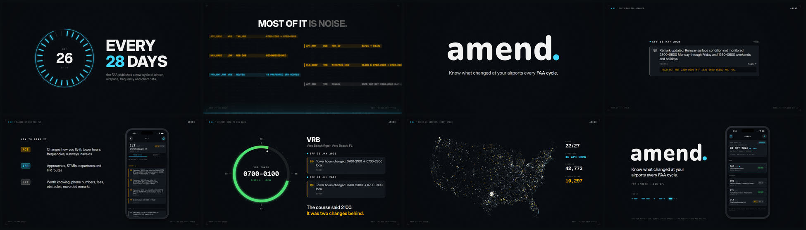

# Amend — 15-second promo

`amend-promo.mp4` is a 15-second promo for the app: 1080p at 60 fps with a 48 kHz
AAC soundtrack, about 6 MB. It runs 8 bars at 128 BPM, one idea per bar. The
picture and the sound are generated from code and from this repo's real data.



## What's on screen

| TC | Shot | Built from |
|---|---|---|
| 00:00 | **Every 28 days**: a 28-tick cycle dial, one tick per day of the NASR cycle | |
| 01:52 | **The noise**: a wall of raw NASR rows (coordinates, survey dates, pavement codes, i.e. the columns `amend/rules.py` hides). A scan line filters them and only real changes stay lit | VRB tower hours, HOB 03/21→04/22, LOR NDB decommissioned, VRB airspace + IFR routes, all from `history/` |
| 03:45 | **amend.**: the wordmark rises and the cyan dot lands | outlines traced from the app icon |
| 05:37 | **Plain-English remarks**: `RSCD NOT MNT 2300-0600 M-F 1530-0600 WKEND AND HOL.` decodes phrase by phrase, then folds into the app's change row with the FAA text expanded | `history/VRB.json`, EFF 15 MAY 2025 |
| 07:30 | **Ranked**: ACT / IFR / FYI / NO CHG light up like annunciators, next to the CLT detail screen | copy from `WelcomeView`, `docs/screenshots/detail.png` |
| 09:22 | **History**: VRB's tower hours on a 24-hour dial, 2100 → 2300 → 0100. "The course said 2100. It was two changes behind." | `history/VRB.json`, the story in the main README |
| 11:15 | **Every US airport, every cycle**: match cut from VRB's dot out to ~20k airports. All 27 cycles play back, each airport flashing in its priority colour while the counters run | `history/` masks per cycle, OurAirports coordinates |
| 13:07 | **End card**: the home screen, the wordmark, and "AMEND" keyed in morse like a navaid ident | `docs/screenshots/home.png` |

Colours are the app's EFB palette from `ios/Amend/Theme.swift`. Inter and Geist
Mono stand in for SF Pro and SF Mono.

The soundtrack is in B minor, tuned so B5 is exactly 1020 Hz, the tone VORs and
NDBs key their morse idents on. That puts the "AMEND" ident at the end in key.
Every visual event has its own sound: day ticks, a ping for each real change
that survives the filter, annunciator chimes, and a blip per FAA cycle on the map.

## Rebuild

Requires Node 22, Python 3 with numpy, scipy, pillow and contourpy, ffmpeg with
libx264, and a Playwright Chromium build.

```sh
./build.sh                                   # picture + sound -> amend-promo.mp4 (~3 min)
node render.mjs sheet --from 0 --to 113      # contact sheet of a range
node render.mjs frames --f 300,760           # full-res stills
```

`dataset/` is a snapshot of `history/` as of the 03 SEP 2026 cycle. To refresh it
after new cycles land, download the OurAirports CSV and re-run the prep:

```sh
curl -LO https://raw.githubusercontent.com/davidmegginson/ourairports-data/main/airports.csv
python3 prep/build_data.py airports.csv      # dataset/map.json, stats.json, wordmark.json
```

Airport coordinates come from [OurAirports](https://ourairports.com/data/),
which is public domain. The fonts are under the SIL Open Font License, and the
licences are in `fonts/`.
