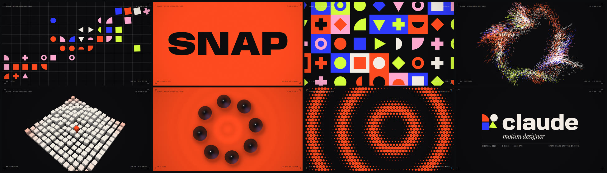

# claude — motion design reel 2026

15 seconds, 900 frames at 60 fps, 1920×1080. Every frame and every sound is
generated from code: no keyframes, no stock footage, no samples.

`showreel.mp4` is the finished piece: H.264 High at 1080p60 with 48 kHz AAC, about 18 MB.



## Shot list

8 bars at 128 BPM, which comes out to exactly 15.000 s. Each shot is one bar, and
each one ends where the next begins, so the shots are match cuts.

| TC | Shot | What it shows |
|---|---|---|
| 00:00 | **00 Intro** | A single dot squashes and stretches into a hairline. The line unfolds into a layout grid, a diagonal cascade of shapes pops in, then everything anticipates and implodes back to the centre. |
| 01:52 | **01 Kinetic type** | Four words, one per beat, each animated to mean itself. SNAP slams in with speed lines. BOUNCE uses gravity, squash & stretch and contact shadows. STRETCH springs the variable-font `wdth` axis with a live dimension line. SHAPE's glyph outlines morph into primitives. |
| 03:45 | **02 Shape systems** | The primitives do a relay of signature moves on 16ths. The row grows into a Bauhaus tile grid and three propagating waves (rotate / morph / card-flip) ripple through it. |
| 05:37 | **03 Particles** | The shapes shatter on the downbeat into ~11k particles sampled from their exact outlines. They ride curl noise into a vortex, every kick blows them outward, and then they are pulled onto a 3D lattice. |
| 07:30 | **04 Dimension** | The lattice extrudes into a 13×13 pillar field under an orbiting camera. Kicks send ring pulses that lift the pillars and light them orange. The camera cranes to top-down and dives into the centre tile. |
| 09:22 | **05 Fluid** | Glossy black ink on orange, done as a WebGL metaball shader with height-from-field normals, specular, fresnel rim, contact shadow and surface ripples. It divides 1→2→4→8 on the beat with area conserved, orbits, re-merges and floods the frame. |
| 11:15 | **06 Rhythm** | Hard cuts on 8ths, then 16ths: halftone field, op-art twist, slot-machine counter, radar, glitch type, a textbook bouncing ball with onion skin, sunburst, ridge lines. Then half a beat of black. |
| 13:07 | **07 Contact** | The drop. Shockwave, the mark slams together, the wordmark rises and tightens, the credits type on and the mark idles on the beat. Then it all implodes into the dot the reel opened with, so it loops. |

The same cue sheet drives picture and sound. Camera shake and chromatic
aberration fire on the impacts, and every visual event gets its own foley.

## How it's made

- **Picture**: canvas 2D + WebGL2 in headless Chromium, driven frame by frame
  with a deterministic clock (`render.mjs`). Each frame averages 5–32
  sub-frame renders for a real 180° shutter motion blur; the fluid shot
  integrates its shutter inside the shader. Raw RGBA goes straight into ffmpeg,
  and any frame re-renders bit-identically on its own.
- **Type**: variable glyph outlines from [fontkit](https://github.com/foliojs/fontkit),
  so weight and width animate continuously and outlines can morph
  (`src/lib/glyphs.js`, `src/lib/shapes.js`).
- **Sim**: the particles are a fixed-step deterministic sim, so any frame
  renders in isolation and the render parallelises across processes.
- **Finishing**: a per-pixel pass handles radial chromatic aberration on
  impacts, vignette and luminance-weighted grain (`src/post.js`).
- **Sound**: `audio/synth.py` synthesises the whole track from oscillators and
  noise (numpy/scipy): kick, clap, 808-style hats, a sidechained rolling bass,
  supersaw stabs and pads in F minor, risers, whooshes and foley. The master is
  about −12 LUFS with a −1.2 dB true peak.

Fonts: [Anybody](https://github.com/Etcetera-Type-Co/Anybody),
[Geist Mono](https://github.com/vercel/geist-font) and
[Instrument Serif](https://github.com/Instrument/instrument-serif). All three
are under the SIL Open Font License, and the licences are in `fonts/`.

## Rebuild

Requires Node 22, Python 3 with numpy + scipy, ffmpeg with libx264, and a
Playwright Chromium build.

```sh
./build.sh                                  # full render -> showreel.mp4
node render.mjs sheet --from 0 --to 113     # contact sheet of a range
node render.mjs frames --f 120,480          # full-res stills
```
